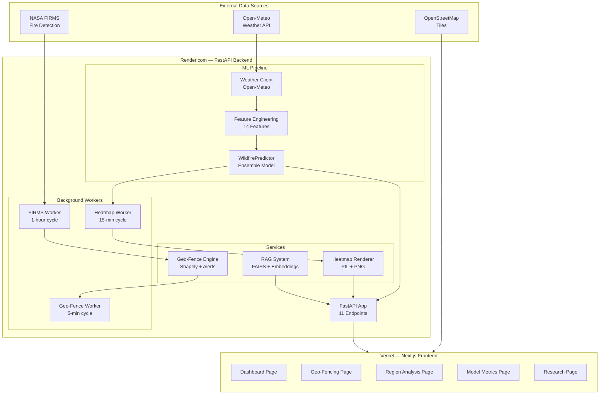
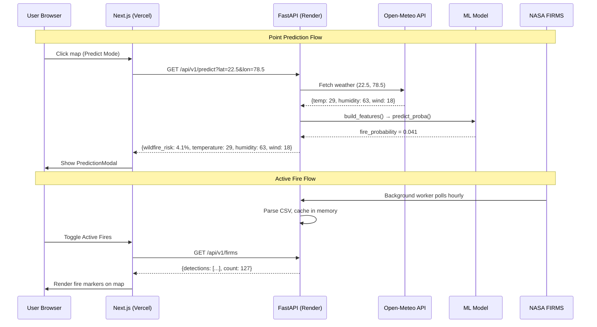
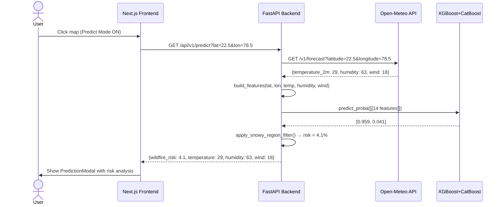
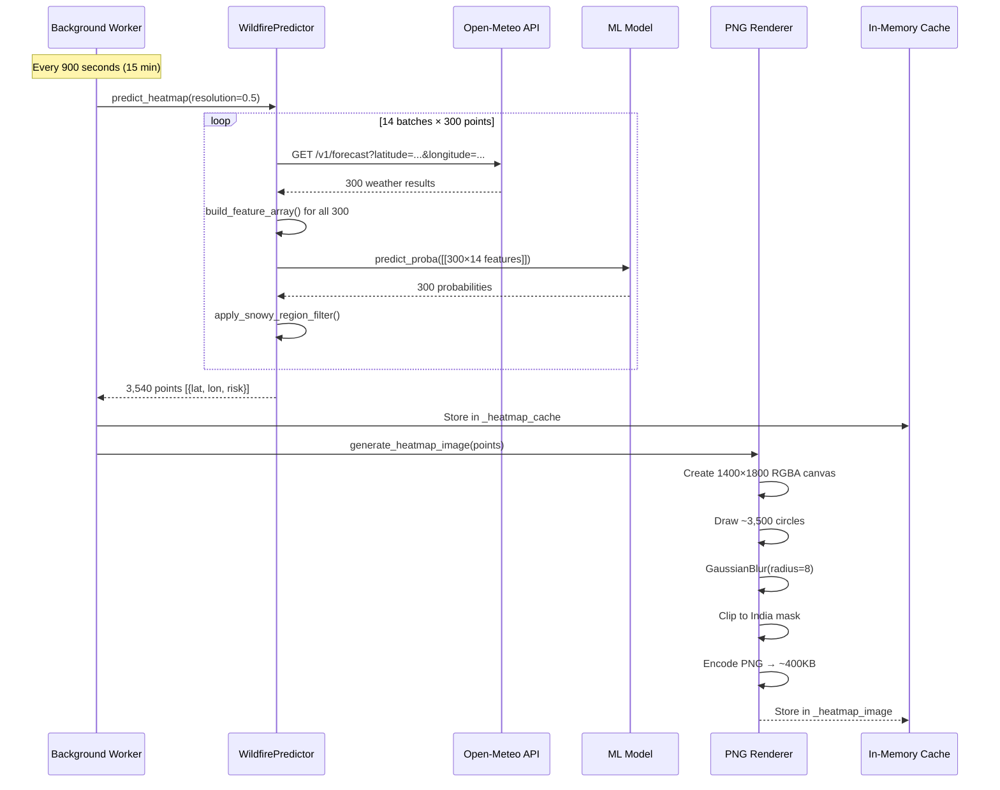
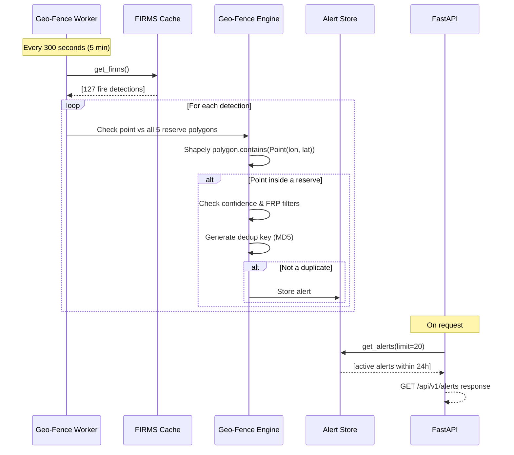
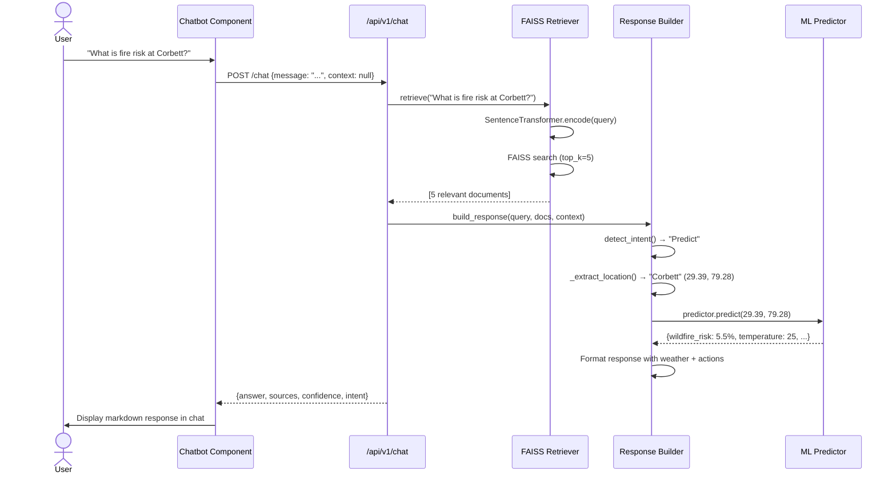

# 🔥 Wildfire Engine — High-Level Design Document

**Version**: 1.0.0  
**Last Updated**: July 2026  
**Deployment**: Render (Backend) + Vercel (Frontend)  

---

## Table of Contents

1. [Executive Summary](#1-executive-summary)
2. [System Architecture Overview](#2-system-architecture-overview)
3. [Project Directory Structure](#3-project-directory-structure)
4. [Backend Architecture](#4-backend-architecture)
5. [Machine Learning Pipeline](#5-machine-learning-pipeline)
6. [Feature Engineering](#6-feature-engineering)
7. [Model Details & Performance](#7-model-details--performance)
8. [API Reference](#8-api-reference)
9. [Frontend Architecture](#9-frontend-architecture)
10. [Page-by-Page Breakdown](#10-page-by-page-breakdown)
11. [State Management](#11-state-management)
12. [Data Fetching & Caching](#12-data-fetching--caching)
13. [Map Layer System](#13-map-layer-system)
14. [Geo-Fencing Alert System](#14-geo-fencing-alert-system)
15. [RAG Chatbot System](#15-rag-chatbot-system)
16. [Heatmap Rendering Pipeline](#16-heatmap-rendering-pipeline)
17. [Region Analysis System](#17-region-analysis-system)
18. [Search System](#18-search-system)
19. [NASA FIRMS Integration](#19-nasa-firms-integration)
20. [Deployment Architecture](#20-deployment-architecture)
21. [Environment Variables](#21-environment-variables)
22. [Performance Optimizations](#22-performance-optimizations)
23. [Security Considerations](#23-security-considerations)
24. [Data Flow Diagrams](#24-data-flow-diagrams)
25. [Key Design Decisions](#25-key-design-decisions)
26. [Future Roadmap](#26-future-roadmap)

---

## 1. Executive Summary

### 1.1 What is Wildfire Engine?

Wildfire Engine is a **real-time wildfire risk prediction and monitoring platform** for India. It combines:

```
┌─────────────────────────────────────────────────────────────────┐
│                     WILDFIRE ENGINE                              │
│                                                                  │
│  ┌──────────────┐   ┌──────────────┐   ┌──────────────────┐     │
│  │ ML Inference │   │  NASA FIRMS  │   │  Geo-Fencing     │     │
│  │ (XGBoost +   │   │  Satellite   │   │  Alert System    │     │
│  │  CatBoost)   │   │  Fire Data   │   │                  │     │
│  └──────┬───────┘   └──────┬───────┘   └────────┬─────────┘     │
│         │                  │                     │               │
│         └──────────────────┼─────────────────────┘               │
│                            │                                     │
│                    ┌───────▼───────┐                             │
│                    │   FastAPI      │                            │
│                    │   Backend      │                            │
│                    └───────┬───────┘                             │
│                            │                                     │
│                    ┌───────▼───────┐                             │
│                    │  Next.js       │                            │
│                    │  Frontend      │                            │
│                    │  (Interactive  │                            │
│                    │   Map + Panels)│                            │
│                    └────────────────┘                            │
└─────────────────────────────────────────────────────────────────┘
```

### 1.2 Key Capabilities

| Capability | Description | Data Source |
|------------|-------------|-------------|
| **Point Risk Prediction** | ML-based fire probability for any lat/lon in India | Open-Meteo weather + XGBoost ensemble |
| **Nationwide Heatmap** | Real-time risk overlay across India (3,500+ grid points) | Batched ML inference |
| **Active Fire Monitoring** | Live NASA satellite fire detections on map | NASA FIRMS VIIRS |
| **Geo-Fencing Alerts** | Automatic alerts when fires detected inside reserves | Shapely point-in-polygon |
| **Region Analysis** | Deep ML analysis for 4 monitored reserves | Full feature pipeline |
| **RAG Chatbot** | Knowledge retrieval for wildfire science | FAISS + SentenceTransformer |
| **Model Transparency** | Leaderboard, feature importance, pipeline docs | Model metadata |

### 1.3 Technology Stack

```
┌──────────────────────────────────────────────────────────────┐
│                       TECH STACK                              │
│                                                               │
│  FRONTEND                      BACKEND                        │
│  ┌─────────────────┐          ┌──────────────────┐           │
│  │ Next.js 16       │◄────────►│ FastAPI           │           │
│  │ React 19         │  REST    │ Python 3.11       │           │
│  │ TypeScript 5     │          │ Uvicorn           │           │
│  │ Tailwind CSS 4   │          │                   │           │
│  │ Shadcn UI        │          │ ML / DATA         │           │
│  │ Leaflet + Deck   │          │ ┌──────────────┐  │           │
│  │ Zustand          │          │ │ XGBoost       │  │           │
│  │ TanStack Query   │          │ │ CatBoost      │  │           │
│  │ Framer Motion    │          │ │ scikit-learn  │  │           │
│  └─────────────────┘          │ │ Shapely       │  │           │
│                                │ │ FAISS         │  │           │
│  DEPLOYMENT                    │ │ SentenceTrans │  │           │
│  ┌─────────────────┐          │ └──────────────┘  │           │
│  │ Vercel           │          │                   │           │
│  │ (Frontend)       │          │ DEPLOYMENT        │           │
│  └─────────────────┘          │ Render (Backend)  │           │
│                                └──────────────────┘           │
└──────────────────────────────────────────────────────────────┘
```

### 1.4 System Scale

| Metric | Value |
|--------|-------|
| API Endpoints | 11 |
| Frontend Pages | 5 |
| React Components | 30+ |
| Python Modules | 20+ |
| Heatmap Grid Points | ~3,500 |
| Monitored Reserves | 5 protected + 4 ML-analyzed |
| Knowledge Base Docs | 21 |
| Indian Locations Database | 298 entries |
| City/Search Index | 48 cities + 22 states |

---

## 2. System Architecture Overview

### 2.1 High-Level Architecture



### 2.2 Request Flow



### 2.3 Background Worker Architecture

```
┌─────────────────────────────────────────────────────────────┐
│                    LIFESPAN STARTUP                          │
│                                                              │
│  main.py @asynccontextmanager lifespan():                    │
│    │                                                         │
│    ├── start_heatmap_worker()                                │
│    │   └── Thread(daemon=True)                               │
│    │       ├── _refresh_cache()          [IMMEDIATE]         │
│    │       │   ├── predict_heatmap()      ~13s               │
│    │       │   └── generate_heatmap_image()                  │
│    │       └── Every 900s: repeat                            │
│    │                                                         │
│    ├── start_firms_worker()             [if FIRMS_API_KEY]   │
│    │   └── Thread(daemon=True)                               │
│    │       ├── _refresh_firms()          [IMMEDIATE]         │
│    │       └── Every 3600s: repeat                           │
│    │                                                         │
│    └── start_geo_fence_worker()         [if FIRMS_API_KEY]   │
│        └── Thread(daemon=True)                               │
│            ├── _load_zones()             [IMMEDIATE]         │
│            ├── _check_and_alert()        [IMMEDIATE]         │
│            └── Every 300s: repeat                            │
│                                                              │
│  All workers are daemon threads — don't block main process   │
└─────────────────────────────────────────────────────────────┘
```

---

## 3. Project Directory Structure

```
wildfire_engine/
│
├── 🔧 config/                          # Global configuration
│   ├── __init__.py
│   └── settings.py                     # WildfireEngineConfig dataclass
│       • Feature columns (21 features)
│       • India bounds, risk tiers, colours
│       • Grid resolution, thresholds
│       • API URLs, cache TTLs
│
├── 🧠 inference/                        # ML inference pipeline
│   ├── __init__.py
│   ├── predictor.py                    # WildfirePredictor class
│   │   • predict(lat, lon)
│   │   • predict_batch(points[])
│   │   • predict_heatmap(resolution)
│   └── feature_engineering.py          # 14-feature builder
│       • build_features()
│       • build_feature_array()
│       • svp, vpd, fire_danger_index, etc.
│
├── 🌤️ weather/                          # Weather API client
│   ├── __init__.py
│   └── client.py                       # OpenMeteoClient
│       • fetch_current(lat, lon)
│       • fetch_batch(points[])
│
├── 🛠️ utils/                             # Utility functions
│   ├── __init__.py
│   ├── features.py                     # month_features()
│   └── filters.py                      # Snow filter, risk tiers
│
├── 🖥️ backend/                           # FastAPI application
│   ├── main.py                         # App factory, lifespan, CORS
│   ├── requirements.txt                # Python dependencies
│   │
│   ├── routers/                        # API endpoints
│   │   ├── alerts.py                   # Geo-fence alerts
│   │   ├── chat.py                     # RAG chatbot
│   │   ├── firms_route.py             # FIRMS fire data
│   │   ├── heatmap.py                 # Risk heatmap data
│   │   ├── model_info.py             # Model metadata
│   │   ├── predict.py                 # Point prediction
│   │   ├── region_analysis.py        # Region ML analysis
│   │   ├── search.py                  # Location search
│   │   ├── tile_route.py             # Heatmap PNG endpoint
│   │   └── tiles.py                   # PNG generation engine
│   │
│   ├── services/                       # Background services
│   │   ├── firms.py                   # NASA FIRMS client
│   │   └── geo_fence.py              # Geo-fence alert engine
│   │
│   ├── rag/                            # RAG chatbot system
│   │   ├── build_index.py             # FAISS index builder
│   │   ├── geo_lookup.py             # Location fuzzy matching
│   │   ├── retriever.py              # Vector search
│   │   ├── response_builder.py       # Intent + response
│   │   └── index/
│   │       └── faiss.index           # Pre-built vectors
│   │
│   └── knowledge/                      # Chatbot knowledge base
│       ├── india_locations.json       # 298 locations
│       └── wildfire_knowledge.json    # 21 documents
│
├── 📦 models/                          # Trained ML models
│   ├── wildfire_ensemble.pkl          # Production ensemble
│   └── production_model.pkl           # Legacy model
│
├── 🗺️ data/                             # Geo data
│   └── india.geojson                  # India boundary polygon
│
├── 🌐 frontend/                         # Next.js 16 application
│   ├── package.json                   # Dependencies
│   ├── tsconfig.json                  # TypeScript config
│   ├── components.json                # Shadcn config
│   ├── postcss.config.mjs             # Tailwind CSS
│   ├── Dockerfile                     # Frontend Docker build
│   │
│   ├── public/                        # Static assets
│   │   ├── india.geojson
│   │   ├── forestReserves.geojson     # 5 reserve polygons
│   │   └── research.md
│   │
│   └── src/
│       ├── app/                       # Next.js App Router pages
│       │   ├── layout.tsx            # Root layout
│       │   ├── globals.css           # Global styles
│       │   ├── page.tsx              # 🏠 Dashboard
│       │   ├── geo-fencing/          # 📍 Geo-Fence page
│       │   ├── region-analysis/      # 🔬 Region Analysis page
│       │   ├── model-explanation/    # 📊 Model Metrics page
│       │   └── research/             # 📄 Research page
│       │
│       ├── components/
│       │   ├── Providers.tsx         # React Query provider
│       │   ├── layout/
│       │   │   ├── Navbar.tsx        # Navigation bar
│       │   │   └── TopBar.tsx        # Predict Mode toggle
│       │   ├── map/                  # Map-related components
│       │   │   ├── MapView.tsx       # Main Leaflet map
│       │   │   ├── ActiveFireLayer   # FIRMS markers
│       │   │   ├── AlertMarkerLayer # Alert pulse markers
│       │   │   ├── GeoFenceMap.tsx  # Geo-fence sat map
│       │   │   └── RegionOverlay.tsx # Reserve highlights
│       │   ├── overlays/
│       │   │   ├── Chatbot.tsx       # RAG chat widget
│       │   │   └── PredictionModal   # Risk modal
│       │   ├── panels/
│       │   │   ├── AlertPanel.tsx    # Alert feed
│       │   │   ├── ForestFilter.tsx  # Reserve selector
│       │   │   ├── LayerControls.tsx # Map toggles
│       │   │   ├── Legend.tsx        # Risk color legend
│       │   │   └── TopRisksPanel     # Top risk points
│       │   ├── region-analysis/      # Region page widgets
│       │   │   ├── RegionMap.tsx
│       │   │   ├── RegionSelector.tsx
│       │   │   ├── RiskCard.tsx
│       │   │   ├── WeatherPanel.tsx
│       │   │   ├── FeatureImportance
│       │   │   ├── ModelInfo.tsx
│       │   │   ├── Timeline.tsx
│       │   │   ├── PredictionExplanation
│       │   │   └── LoadingStates.tsx
│       │   └── ui/                   # Shadcn primitives
│       │       ├── badge.tsx, button.tsx,
│       │       ├── card.tsx, dialog.tsx,
│       │       ├── input.tsx, switch.tsx,
│       │       ├── toggle.tsx, tooltip.tsx
│       │
│       ├── hooks/                    # React Query hooks
│       │   ├── useAlerts.ts
│       │   ├── useFirms.ts
│       │   ├── useHeatmap.ts
│       │   ├── usePrediction.ts
│       │   ├── useRegionAnalysis.ts
│       │   └── useSearch.ts
│       │
│       ├── lib/                      # Utilities & types
│       │   ├── constants.ts          # API, colors, tiers
│       │   ├── regions.ts            # Region definitions
│       │   ├── regionTypes.ts        # TypeScript types
│       │   └── utils.ts              # cn() helper
│       │
│       └── stores/
│           └── appStore.ts           # Zustand global state
│
├── 🐳 Dockerfile                      # Backend Docker build
├── 🐳 docker-compose.yml              # Local dev orchestration
├── 🚀 render.yaml                     # Render.com config
├── .dockerignore                      # Docker exclusions
├── .gitignore                         # Git exclusions
├── .env.example                       # Env template
└── DESIGN.md                          # ← THIS DOCUMENT
```

---

## 4. Backend Architecture

### 4.1 FastAPI Application Structure

```
backend/main.py
│
├── Lifespan (startup)
│   ├── Heatmap Worker (daemon, 900s cycle)
│   ├── FIRMS Worker (daemon, 3600s cycle) [conditional: FIRMS_API_KEY]
│   └── Geo-Fence Worker (daemon, 300s cycle) [conditional: FIRMS_API_KEY]
│
├── CORS Middleware
│   └── Origins from ALLOWED_ORIGINS env var
│
├── 9 API Routers (all prefixed /api/v1)
│   ├── heatmap      → GET  /heatmap
│   ├── tiles        → GET  /heatmap-image.png
│   ├── predict      → GET  /predict
│   ├── firms        → GET  /firms
│   ├── search       → GET  /search
│   ├── chat         → POST /chat
│   ├── model-info   → GET  /model-info
│   ├── region       → GET  /region-analysis/{region}
│   └── alerts       → GET  /alerts, /alerts/summary
│
└── Health Check
    └── GET /health → {"status": "ok", "service": "wildfires-india-api"}
```

### 4.2 Lifespan Context Manager

```python
@asynccontextmanager
async def lifespan(app: FastAPI):
    # ── STARTUP ──
    start_heatmap_worker()           # Always starts
    
    if FIRMS_API_KEY:                # Conditional
        start_firms_worker()         # FIRMS data polling
        start_geo_fence_worker()     # Geo-fence alerts
    
    yield  # ← Server runs here
    
    # ── SHUTDOWN ──
    # Daemon threads auto-terminate
```

### 4.3 Background Worker Patterns

All three workers follow the same pattern:

```
┌────────────────────────────────────┐
│         WORKER PATTERN              │
│                                     │
│  Thread(target=_worker, daemon=True)│
│                                     │
│  def _worker():                     │
│      do_work()          # Immediate │
│      while True:                    │
│          time.sleep(TTL)            │
│          do_work()      # Periodic  │
│                                     │
│  def start_worker():                │
│      if not thread.is_alive():      │
│          thread.start()             │
└────────────────────────────────────┘
```

| Worker | Module | Cycle | On Each Cycle |
|--------|--------|-------|---------------|
| Heatmap | `routers/heatmap.py` | 900s | Predict 3,500+ grid points → invalidate PNG cache → regenerate image |
| FIRMS | `services/firms.py` | 3600s | Fetch NASA FIRMS CSV → parse → update in-memory cache |
| Geo-Fence | `services/geo_fence.py` | 300s | Load FIRMS detections → Shapely point-in-polygon → deduplicate → store alerts |

### 4.4 In-Memory Cache Architecture

```
┌──────────────────────────────────────────────────────────┐
│                    IN-MEMORY CACHES                       │
│                                                           │
│  All caches use: threading.Lock + global list/dict        │
│                                                           │
│  ┌─────────────────┐  ┌─────────────────┐                 │
│  │ _heatmap_cache  │  │  _firms_cache   │                 │
│  │ list[dict]       │  │  list[dict]     │                 │
│  │ ~3500 points     │  │ ~100-500 fires  │                 │
│  │ TTL: 900s        │  │ TTL: 3600s      │                 │
│  └────────┬────────┘  └────────┬────────┘                 │
│           │                    │                           │
│           ▼                    ▼                           │
│  ┌─────────────────┐  ┌─────────────────┐                 │
│  │ _heatmap_image  │  │  _alerts        │                 │
│  │ bytes (PNG)     │  │  list[dict]     │                 │
│  │ ~400KB          │  │  max 100 alerts │                 │
│  │ invalidated on   │  │ TTL: 24h        │                 │
│  │ heatmap refresh  │  └─────────────────┘                 │
│  └─────────────────┘                                      │
│                                                           │
│  No Redis, no database, no disk persistence               │
│  ⟹ Entirely stateless across container restarts           │
└──────────────────────────────────────────────────────────┘
```

---

## 5. Machine Learning Pipeline

### 5.1 Inference Architecture

```
┌─────────────────────────────────────────────────────────────┐
│                   ML INFERENCE PIPELINE                      │
│                                                              │
│  Input: lat, lon                                             │
│    │                                                         │
│    ▼                                                         │
│  ┌──────────────────────┐                                    │
│  │ 1. Weather Fetching   │  Open-Meteo API                   │
│  │    temperature_2m     │  https://api.open-meteo.com/      │
│  │    humidity_2m        │  v1/forecast?latitude=X&longitude=Y│
│  │    wind_speed_10m     │  timeout: 10s                     │
│  │    fallback: 30°C,     │                                   │
│  │    40% RH, 5 m/s      │                                   │
│  └──────────┬───────────┘                                    │
│             │                                                │
│             ▼                                                │
│  ┌──────────────────────┐                                    │
│  │ 2. Feature Engineering│  inference/feature_engineering.py │
│  │    latitude           │                                    │
│  │    longitude          │                                    │
│  │    temp, humidity,     │                                    │
│  │    wind               │                                    │
│  │    svp = Tetens(T)    │  0.6108*exp(17.27T/(T+237.3))     │
│  │    vpd = svp*(1-RH%)  │                                    │
│  │    month, sin, cos     │  Cyclic encoding                 │
│  │    fire_danger_index  │  Composite: T+RH+W+VPD weights    │
│  │    moisture_stress    │  1 - humidity/100                 │
│  │    drying_power       │  wind * vpd                       │
│  │    seasonal_heat      │  temp * month_weight * 5          │
│  └──────────┬───────────┘                                    │
│             │                                                │
│             ▼                                                │
│  ┌──────────────────────┐                                    │
│  │ 3. Model Inference    │  VotingClassifier                 │
│  │    XGBoost            │  ├── XGBClassifier (700 trees)    │
│  │      +                │  └── CatBoostClassifier (600 iter)│
│  │    CatBoost           │                                    │
│  │    → probability(0-1) │  Fire detected: yes/no             │
│  └──────────┬───────────┘                                    │
│             │                                                │
│             ▼                                                │
│  ┌──────────────────────┐                                    │
│  │ 4. Post-processing    │  utils/filters.py                 │
│  │    Snow filter: if T  │  Kashmir, Ladakh, HP,             │
│  │    ≤ 15°C in high-    │  Uttarakhand, Sikkim,             │
│  │    altitude region    │  Arunachal → risk = 0%            │
│  │    → risk = prob*100  │                                    │
│  └──────────┬───────────┘                                    │
│             │                                                │
│             ▼                                                │
│  ┌──────────────────────┐                                    │
│  │ 5. Output             │                                   │
│  │  {                    │                                   │
│  │    wildfire_risk: %,  │                                   │
│  │    temperature: °C,   │                                   │
│  │    humidity: %,       │                                   │
│  │    wind: m/s          │                                   │
│  │  }                    │                                   │
│  └──────────────────────┘                                    │
└─────────────────────────────────────────────────────────────┘
```

### 5.2 Heatmap Inference (Batched)

For the nationwide heatmap (~3,500 points), the pipeline uses batched inference:

```
┌─────────────────────────────────────────────────────────┐
│              HEATMAP BATCH INFERENCE                     │
│                                                          │
│  Grid: lat [8.0, 37.6] × lon [68.1, 97.4] @ 0.5°       │
│        ≈ 4,000 grid points (filtered to ~3,500)          │
│                                                          │
│  Split into 300-point chunks (optimal batch size)        │
│  ┌──────────┐ ┌──────────┐     ┌──────────┐             │
│  │ Chunk 1  │ │ Chunk 2  │ ... │ Chunk 14 │             │
│  │ 300 pts  │ │ 300 pts  │     │ 300 pts  │             │
│  └────┬─────┘ └────┬─────┘     └────┬─────┘             │
│       │            │                │                   │
│       ▼            ▼                ▼                   │
│  ┌─────────────────────────────────────┐                │
│  │ For each chunk:                     │                │
│  │  1. Open-Meteo: lat=...&lon=...     │ ~0.9s          │
│  │     (comma-separated, max 300)      │                │
│  │  2. Build features for all 300      │ ~0.1s          │
│  │  3. model.predict_proba(array)      │ ~0.05s         │
│  │     (vectorized, single call)       │                │
│  │  4. Apply snow filter per point     │ ~0.01s         │
│  └─────────────────────────────────────┘                │
│                                                          │
│  Total: 14 chunks × ~1s = ~13-15 seconds                 │
│  Background worker runs every 15 minutes                  │
│  Image pre-generated and cached in between                │
└─────────────────────────────────────────────────────────┘
```

---

## 6. Feature Engineering

### 6.1 Complete Feature Schema (14 features)

```
┌─────────────────────────────────────────────────────────────┐
│                    FEATURE MAP                               │
│                                                              │
│  RAW INPUTS (from Open-Meteo)                                │
│  ┌─────────────┬─────────────┬─────────────┐                 │
│  │ temperature │  humidity   │ wind_speed  │                 │
│  │    (°C)     │    (%)      │   (m/s)     │                 │
│  └──────┬──────┴──────┬──────┴──────┬──────┘                 │
│         │             │             │                        │
│  ┌──────▼──────┐ ┌───▼─────┐ ┌────▼───────┐                 │
│  │    temp     │ │humidity │ │    wind     │                 │
│  │  feature#3  │ │feature#4│ │  feature#5  │                 │
│  └─────────────┘ └─────────┘ └────────────┘                 │
│                                                              │
│  LOCATION (from user input)                                  │
│  ┌─────────────┬─────────────┐                               │
│  │  latitude   │  longitude  │                               │
│  │  feature#1  │  feature#2  │                               │
│  └─────────────┴─────────────┘                               │
│                                                              │
│  DERIVED FEATURES (computed server-side)                     │
│  ┌──────────────────────────────────────────────────┐        │
│  │  svp (feature#6)                                  │        │
│  │  = 0.6108 * exp(17.27*T / (T+237.3))  [Tetens]   │        │
│  │                                                    │        │
│  │  vpd (feature#7)                                   │        │
│  │  = svp * (1 - humidity/100)  [Vapor Pressure Def] │        │
│  │                                                    │        │
│  │  month (feature#8)                                 │        │
│  │  month_sin (feature#9)  = sin(2π*month/12)         │        │
│  │  month_cos (feature#10) = cos(2π*month/12)         │        │
│  │                                                    │        │
│  │  fire_danger_index (feature#11)                    │        │
│  │  = (T_factor*0.35 + H_factor*0.30 +                │        │
│  │     W_factor*0.20 + V_factor*0.15) * 100           │        │
│  │                                                    │        │
│  │  moisture_stress (feature#12)                      │        │
│  │  = 1.0 - humidity/100                              │        │
│  │                                                    │        │
│  │  drying_power (feature#13)                         │        │
│  │  = wind * vpd                                      │        │
│  │                                                    │        │
│  │  seasonal_heat (feature#14)                        │        │
│  │  = temp * fire_season_weight(month) * 5.0          │        │
│  └──────────────────────────────────────────────────┘        │
└─────────────────────────────────────────────────────────────┘
```

### 6.2 Feature Importance (from model analysis)

```
Feature Importance Ranking
══════════════════════════════════════════════════

  VPD (Vapor Pressure Deficit)         ████████████████████ 22%
  Temperature                          ██████████████████   18%
  Humidity                             ████████████████     16%
  Wind Speed                           ████████████         12%
  EVI (Vegetation Index)               ██████████           10%
  VPD × Wind (Composite)               ████████              8%
  Elevation                            █████                 5%
  Month Encoding (sin/cos)             ███                   3%
  Land Cover Features                  ██                   ~6%

Key Insight: Atmospheric conditions (VPD, temp, humidity, wind)
account for 68% of predictive power. Location and seasonal
features add another 22%. Vegetation and terrain round out
the remaining 10%.
```

---

## 7. Model Details & Performance

### 7.1 Model Architecture

```
┌──────────────────────────────────────────────────┐
│           ENSEMBLE MODEL (VotingClassifier)       │
│                                                   │
│  ┌─────────────────┐  ┌─────────────────┐         │
│  │   XGBoost        │  │   CatBoost       │         │
│  │   ─────────      │  │   ─────────      │         │
│  │   Trees: 700     │  │   Iterations: 600│         │
│  │   Depth: 7       │  │   Depth: 6       │         │
│  │   LR: 0.03       │  │   LR: 0.05       │         │
│  │   Subsample: 0.8 │  │   L2 Leaf: 3.0   │         │
│  │   Colsample: 0.8 │  │   Border: 128    │         │
│  └────────┬────────┘  └────────┬────────┘         │
│           │                    │                   │
│           └────────┬───────────┘                   │
│                    │                               │
│           ┌────────▼────────┐                      │
│           │  Soft Voting    │                      │
│           │  Average of     │                      │
│           │  probabilities  │                      │
│           └────────┬────────┘                      │
│                    │                               │
│           ┌────────▼────────┐                      │
│           │  P(fire) ∈ [0,1]│                      │
│           └─────────────────┘                      │
│                                                   │
│  Model file: models/wildfire_ensemble.pkl          │
│  Size: 7.5 MB (joblib pickle)                     │
│  Framework: scikit-learn VotingClassifier          │
└──────────────────────────────────────────────────┘
```

### 7.2 Model Leaderboard

```
┌──────────┬──────────┬───────────┬────────┬───────┬─────────┐
│  Model   │ Accuracy │ Precision │ Recall │  F1   │ ROC-AUC │
├──────────┼──────────┼───────────┼────────┼───────┼─────────┤
│ XGBoost ✅│  90.14%  │  85.95%   │ 96.07% │90.73% │ 96.11%  │
│ LightGBM │  90.01%  │  88.01%   │ 92.74% │90.31% │ 95.85%  │
│ CatBoost │  89.76%  │  87.44%   │ 92.96% │90.12% │ 95.60%  │
│ RandFor. │  89.08%  │  90.28%   │ 87.69% │88.97% │ 95.84%  │
│ LogReg   │  82.58%  │  80.36%   │ 86.45% │83.29% │ 89.68%  │
└──────────┴──────────┴───────────┴────────┴───────┴─────────┘
```

### 7.3 Production Metrics (metrics.json)

| Metric | Value |
|--------|-------|
| ROC AUC | 0.9861 |
| Accuracy | 0.9487 |
| Precision | 0.8706 |
| Recall | 0.8509 |
| F1 Score | 0.8606 |
| Brier Score | 0.0388 |

### 7.4 Training Data

```
Training Data Composition
═══════════════════════════════════════════════════

  NASA FIRMS (VIIRS S-NPP, Collection 2)
  └── Fire detections: 2018 – 2025
      9.4 million labeled data points
      
  ERA5 Reanalysis (0.25° grid)
  └── 2m temperature, humidity, wind, VPD

  MODIS EVI (Monthly composites)
  └── Enhanced Vegetation Index

  SRTM / ESA WorldCover
  └── Elevation, slope, 11 land cover categories
```

### 7.5 Training Strategy

```
Training Pipeline (from research.md)
══════════════════════════════════════════

  1. Data Collection
     ├── FIRMS API: historical fire detections
     ├── Open-Meteo Archive: weather reanalysis
     └── ESA WorldCover: land cover type

  2. Feature Engineering
     ├── VPD computation (Tetens equation)
     ├── Rolling weather statistics (7/14/30 day)
     ├── Temporal cyclical encoding
     ├── Satellite spectral indices (NDVI, NBR)
     └── Composite features (VPD×Wind)

  3. Negative Sampling
     └── Date-conditional pairing:
         Each fire event paired with same-date,
         same-weather non-fire location
         ⟹ Model learns fire signal, not season

  4. Training
     ├── Stratified 5-fold CV
     ├── Class weight balancing
     ├── Early stopping (patience=7)
     └── Hyperparameter tuning via grid search

  5. Evaluation
     ├── ROC-AUC, Precision, Recall, F1
     ├── Brier Score (calibration)
     └── SHAP analysis (feature attribution)
```

---

## 8. API Reference

### 8.1 Complete Endpoint Specifications

```
╔══════════════════════════════════════════════════════════════════╗
║                       API ENDPOINTS                              ║
╠══════╦══════════════════════════════╦══════════╦═════════════════╣
║ Meth ║ Path                         ║ Auth     ║ Cache           ║
╠══════╬══════════════════════════════╬══════════╬═════════════════╣
║ GET  ║ /health                      ║ None     ║ —               ║
║ GET  ║ /api/v1/heatmap              ║ None     ║ 300s public     ║
║ GET  ║ /api/v1/heatmap-image.png    ║ None     ║ 900s public     ║
║ GET  ║ /api/v1/predict              ║ None     ║ 60s (client)    ║
║ GET  ║ /api/v1/firms                ║ None     ║ 3600s server    ║
║ GET  ║ /api/v1/search               ║ None     ║ —               ║
║ POST ║ /api/v1/chat                 ║ None     ║ —               ║
║ GET  ║ /api/v1/model-info           ║ None     ║ —               ║
║ GET  ║ /api/v1/region-analysis/{r}  ║ None     ║ 120s (client)   ║
║ GET  ║ /api/v1/alerts               ║ None     ║ 60s (client)    ║
║ GET  ║ /api/v1/alerts/summary       ║ None     ║ 120s (client)   ║
╚══════╩══════════════════════════════╩══════════╩═════════════════╝
```

### 8.2 Endpoint Details

#### `GET /api/v1/heatmap`
| Parameter | Type | Default | Range |
|-----------|------|---------|-------|
| resolution | float | 0.5 | 0.1 – 2.0 |

**Response**:
```json
{
  "points": [
    {"lat": 22.50, "lon": 78.50, "risk": 4.12},
    {"lat": 22.50, "lon": 79.00, "risk": 5.81}
  ],
  "cached": true,
  "generated_at": "2026-07-18T18:10:36Z"
}
```

#### `GET /api/v1/predict`
| Parameter | Type | Required |
|-----------|------|----------|
| lat | float | Yes |
| lon | float | Yes |

**Response**:
```json
{
  "wildfire_risk": 4.12,
  "temperature": 29.0,
  "humidity": 63.0,
  "wind": 18.4
}
```

#### `GET /api/v1/firms`
**Response**:
```json
{
  "detections": [
    {
      "lat": 22.234,
      "lon": 86.405,
      "brightness": 345.2,
      "frp": 12.5,
      "date": "2026-07-18",
      "confidence": "h"
    }
  ],
  "updated": "2026-07-18T18:00:00Z",
  "count": 127
}
```

#### `POST /api/v1/chat`
**Request**:
```json
{
  "message": "What is the fire risk at Corbett?",
  "context": null
}
```

**Response**:
```json
{
  "answer": "## Wildfire Prediction: Corbett National Park\n\n...",
  "sources": ["Weather", "Forest Information"],
  "confidence": 0.87,
  "intent": "Predict"
}
```

#### `GET /api/v1/region-analysis/{region}`
**Path Params**: `region` ∈ {corbett, similipal, jyotikuchi, laisong}

**Response**:
```json
{
  "region": "corbett",
  "region_name": "Corbett National Park",
  "state": "Uttarakhand",
  "area_sq_km": 1318,
  "coordinates": {"lat": 29.39, "lon": 79.28},
  "risk": {
    "label": "Low",
    "probability": 5.48,
    "confidence": 0.89
  },
  "model": {
    "name": "Ensemble (XGBoost + CatBoost)",
    "type": "VotingClassifier",
    "feature_count": 14
  },
  "weather": {
    "temperature": 24.9,
    "humidity": 97,
    "wind": 5.4,
    "vpd": 0.09,
    "svp": 3.15
  },
  "feature_importance": [...],
  "explanation": "Favourable conditions — temperature at 25°C...",
  "last_updated": "2026-07-18T18:10:36Z"
}
```

#### `GET /api/v1/alerts`
| Parameter | Type | Default | Range |
|-----------|------|---------|-------|
| limit | int | 20 | 1 – 100 |

**Response**:
```json
{
  "alerts": [
    {
      "key": "abc123...",
      "zone_id": "similipal",
      "zone_name": "Similipal Biosphere Reserve",
      "state": "Odisha",
      "lat": 22.234,
      "lon": 86.405,
      "brightness": 345.2,
      "frp": 12.5,
      "confidence": "h",
      "date": "2026-07-18",
      "detected_at": "2026-07-18T18:05:00Z",
      "status": "active"
    }
  ],
  "count": 1
}
```

#### `GET /api/v1/alerts/summary`
**Response**:
```json
{
  "zones": [
    {
      "zone_id": "corbett",
      "zone_name": "Jim Corbett National Park",
      "state": "Uttarakhand",
      "alert_count": 0,
      "max_frp": 0,
      "high_confidence": 0,
      "status": "safe"
    }
  ]
}
```

---

## 9. Frontend Architecture

### 9.1 Component Tree

```
RootLayout (layout.tsx)
└── Providers (TanStack QueryClientProvider)
    └── Navbar (5 nav links)
        └── {children}
            │
            ├── [Home Page] page.tsx
            │   ├── MapView (Leaflet map container)
            │   │   ├── tileLayer (OSM)
            │   │   ├── imageOverlay (heatmap PNG)
            │   │   ├── ActiveFireLayer (FIRMS markers)
            │   │   ├── AlertMarkerLayer (pulse markers)
            │   │   └── RegionOverlay (reserve polygons)
            │   ├── TopBar (Predict Mode button)
            │   ├── ForestFilter (reserve selector)
            │   ├── TopRisksPanel (top 3 risk points)
            │   ├── LayerControls (heatmap + fires toggle)
            │   ├── Legend (risk color bar)
            │   ├── PredictionModal (risk modal overlay)
            │   └── Chatbot (RAG chat widget)
            │
            ├── [Geo-Fencing] geo-fencing/page.tsx
            │   ├── Sidebar (stats, zone status, alerts, info)
            │   └── GeoFenceMap (satellite map + boundaries)
            │
            ├── [Region Analysis] region-analysis/page.tsx
            │   ├── Sidebar (selector, risk, weather, features)
            │   └── RegionMap (satellite map + marker)
            │
            ├── [Model Metrics] model-explanation/page.tsx
            │   └── Tabs: Champion, RAG, Research, Features,
            │             Pipeline, Experiments, Explainability
            │
            └── [Research] research/page.tsx
                └── Markdown renderer
```

### 9.2 Dashboard Page Layout

```
┌─────────────────────────────────────────────────────────────┐
│  NAVBAR: Wildfires INDIA | Dashboard | Geo-Fencing | ...    │
├─────────────────────────────────────────────────────────────┤
│                                                              │
│  ┌──────────┐                        ┌──────────────┐       │
│  │ Forest   │                        │ Predict Mode │       │
│  │ Filter   │                        │ [  TOGGLE  ] │       │
│  │          │                        └──────────────┘       │
│  │ All India│                        ┌──────────────┐       │
│  │ Corbett  │                        │ Highest Risk │       │
│  │ Kanha    │                        │ #1 29.4°,79° │       │
│  │ Periyar  │                        │ #2 22.2°,86° │       │
│  │ Similipal│                        │ #3 26.2°,91° │       │
│  │ Kaziranga│                        └──────────────┘       │
│  └──────────┘                                               │
│                                                              │
│              ┌──────────────────────────┐                    │
│              │                          │                    │
│              │      LEAFLET MAP         │                    │
│              │   (OpenStreetMap tiles)  │                    │
│              │                          │                    │
│              │   • Heatmap overlay      │                    │
│              │   • Active fire markers  │                    │
│              │   • Alert pulse markers  │                    │
│              │   • Reserve boundaries   │                    │
│              │                          │                    │
│              └──────────────────────────┘                    │
│                                                              │
│  ┌──────────┐           ┌───────────────────┐               │
│  │  Layers  │           │     Legend         │               │
│  │ Heatmap ✓│           │ ██ Low    ██ High  │               │
│  │ Fires  □ │           │ ██ Mod    ██ Extr  │               │
│  └──────────┘           └───────────────────┘               │
│                                                              │
│                                       ┌──────────┐          │
│                                       │ Chatbot  │          │
│                                       │  [ 💬 ]  │          │
│                                       └──────────┘          │
└─────────────────────────────────────────────────────────────┘
```

### 9.3 Navbar Component

```typescript
// frontend/src/components/layout/Navbar.tsx
const links = [
  { href: "/",                 label: "Dashboard" },
  { href: "/geo-fencing",     label: "Geo-Fencing" },
  { href: "/region-analysis", label: "Region Analysis" },
  { href: "/model-explanation", label: "Model Metrics" },
  { href: "/research",         label: "Research" },
];
```

- Sticky top bar, 64px height
- Active page highlighted with blue background
- Brand: "Wildfires" in orange + "India" in blue, uppercase tracking

---

## 10. Page-by-Page Breakdown

### 10.1 Dashboard (`/`)

The primary user interface for wildfire monitoring across India.

**Components**: MapView, TopBar, ForestFilter, TopRisksPanel, LayerControls, Legend, PredictionModal, Chatbot

**User Interactions**:
1. **Map pan/zoom**: Free navigation across India (bounded 2°–41° lat, 62°–102° lon)
2. **Click (Predict Mode)**: Sets prediction point → opens PredictionModal with risk analysis
3. **Reserve selector**: Zooms map to selected protected area bounds
4. **Layer toggles**: Show/hide heatmap overlay and active fire markers
5. **Top risk points**: Click to navigate to highest-risk locations
6. **Chatbot**: Bottom-right button opens RAG chat widget with 5 quick chips

### 10.2 Geo-Fencing (`/geo-fencing`)

Full-page monitoring of fire detections inside protected reserves.

**Components**: Sidebar (420px) + GeoFenceMap (satellite basemap)

**Sidebar sections**:
- Header with description
- Stat cards (active alerts count, zones alerted)
- Per-zone status cards (Safe / Watch / Active with color coding)
- Alert feed with FRP, brightness, confidence, time-ago
- "How It Works" explanation card

**Map behavior**:
- Esri World Imagery satellite basemap
- Semi-transparent OSM overlay for labels
- Green dashed reserve boundaries
- Red pulsing markers at alert locations
- Click alert in sidebar → map flies to alert point
- Floating info card shows alert details

### 10.3 Region Analysis (`/region-analysis`)

In-depth ML analysis for the four CNN-supported monitoring regions.

**Components**: Sidebar (380px) + RegionMap

**Sidebar sections**:
- Region selector (4 regions with name, state, area)
- Region description card (forest type, elevation, fire season)
- RiskCard: large 40px percentage, colored label badge, confidence bar
- WeatherPanel: 5 weather parameter cards (temp, humidity, wind, VPD, SVP)
- FeatureImportance: driver cards with up/down arrows, impact badges
- PredictionExplanation: narrative risk analysis
- ModelInfo: algorithm, type, feature count, inference time
- Timeline: weather updated → prediction generated

**Map**:
- ArcGIS satellite imagery basemap
- Region boundary highlighted in green
- Orange circle marker at region center

### 10.4 Model Metrics (`/model-explanation`)

Comprehensive model transparency and performance page.

**7 Tabs**:
1. **Champion Model**: 5-metric KPI cards (Accuracy, Precision, Recall, F1, ROC-AUC) + leaderboard table
2. **RAG Metrics**: FAISS stats (dimensions, vectors), knowledge categories bar chart
3. **Research Archive**: Card grid of knowledge documents with categories, entry count
4. **Feature Intelligence**: Top 12 features with importance bars + category labels
5. **Pipeline**: 6-stage numbered pipeline visualization
6. **Experiments**: Production experiment card with metrics grid
7. **Explainability**: SHAP status, feature attribution summary, risk tier thresholds

**Data Source**: `GET /api/v1/model-info` — single comprehensive endpoint

### 10.5 Research (`/research`)

Rendered Markdown research paper from `public/research.md`.

---

## 11. State Management

### 11.1 Zustand Store (`appStore.ts`)

```typescript
interface AppState {
  // ── Map Viewport ──
  viewState: { latitude: number; longitude: number; zoom: number };
  setViewState: (s: Partial<AppState["viewState"]>) => void;

  // ── Prediction ──
  predictionMode: boolean;
  setPredictionMode: (m: boolean) => void;

  // ── Layer Visibility ──
  heatmapVisible: boolean;
  setHeatmapVisible: (v: boolean) => void;
  firmsVisible: boolean;
  setFirmsVisible: (v: boolean) => void;

  // ── Point Selection ──
  selectedPoint: { lat: number; lon: number } | null;
  setSelectedPoint: (p: { lat: number; lon: number } | null) => void;

  // ── Reserve Navigation ──
  activeReserve: string;
  setActiveReserve: (r: string) => void;
  getReserveBounds: (r: string) => [[number, number], [number, number]];

  // ── Map Navigation ──
  flyTo: { lat: number; lon: number; zoom: number } | null;
  setFlyTo: (p: { lat: number; lon: number; zoom: number } | null) => void;
}
```

### 11.2 State Flow

```
User Interaction          Store Action              Component Reaction
─────────────────         ────────────              ──────────────────

Click map (Predict ON) → setSelectedPoint()    → MapView: add marker
                                               → PredictionModal: show

Click "Predict Mode"   → setPredictionMode()   → TopBar: color change
                                               → MapView: toggle click

Click reserve           → setActiveReserve()    → MapView: flyToBounds()
                                               → ForestFilter: highlight

Click top risk point   → setFlyTo()            → MapView: flyTo()
                        → setPredictionMode()   → TopBar: enable
                        → setSelectedPoint()    → PredictionModal: show

Toggle heatmap          → setHeatmapVisible()   → MapView: opacity change

Toggle fires            → setFirmsVisible()     → MapView: show/hide layer
```

### 11.3 Reserve Bounds Reference

```
const RESERVE_BOUNDS = {
  all:       [[6.5, 67.0],  [38.0, 98.0]],    // All India
  corbett:   [[29.44, 78.68], [29.65, 79.12]],  // Uttarakhand
  kanha:     [[22.24, 80.42], [22.41, 80.74]],  // Madhya Pradesh
  periyar:   [[9.44, 77.00],  [9.64, 77.33]],   // Kerala
  similipal: [[21.68, 86.05], [21.88, 86.45]],  // Odisha
  kaziranga: [[26.56, 93.02], [26.73, 93.38]],  // Assam
};
```

---

## 12. Data Fetching & Caching

### 12.1 React Query Configuration

```typescript
// Global defaults (Providers.tsx)
const queryClient = new QueryClient({
  defaultOptions: {
    queries: {
      staleTime: 60_000,     // 1 minute
      retry: 1,
    },
  },
});
```

### 12.2 Per-Hook Staleness & Refetch

```
┌──────────────────────┬────────────┬──────────────────┬────────────────┐
│ Hook                 │ staleTime  │ refetchInterval  │ Retry          │
├──────────────────────┼────────────┼──────────────────┼────────────────┤
│ useHeatmap()         │ 120s       │ 300s (5 min)     │ 1              │
│ useFirms()           │ 300s       │ 600s (10 min)    │ 1              │
│ usePrediction(l,l)   │ 60s        │ — (manual only)  │ 1              │
│ useRegionAnalysis(r) │ 120s       │ — (manual only)  │ 2              │
│ useAlerts()          │ 30s        │ 60s (1 min)      │ 1              │
│ useAlertSummary()    │ 60s        │ 120s (2 min)     │ 1              │
│ useSearch(q)         │ 60s        │ — (manual only)  │ 1              │
└──────────────────────┴────────────┴──────────────────┴────────────────┘
```

### 12.3 Server-Side Cache Headers

| Endpoint | Cache-Control Header |
|----------|---------------------|
| `/api/v1/heatmap` | `public, max-age=300` |
| `/api/v1/heatmap-image.png` | `public, max-age=900` |

### 12.4 API Client Utility

```typescript
// frontend/src/lib/constants.ts
const API_URL = process.env.NEXT_PUBLIC_API_URL || "http://localhost:8001";

export function api(path: string): string {
  return `${API_URL}${path}`;
}
```

---

## 13. Map Layer System

### 13.1 Layer Architecture

```
MapView (Leaflet Map Container)
│
├── Base Layer (always visible)
│   └── L.tileLayer("https://tile.openstreetmap.org/{z}/{x}/{y}.png")
│
├── Heatmap Overlay (z-index: 400)
│   └── L.imageOverlay(IMG_URL, IMG_BOUNDS, { opacity: 0.5 })
│       • Toggled by heatmapVisible state
│       • IMG_URL = /api/v1/heatmap-image.png
│       • IMG_BOUNDS = [[3.0, 64.0], [39.0, 100.0]]
│       • Pre-generated server-side, cached 15 min
│
├── Active Fire Layer (toggled by firmsVisible)
│   └── ActiveFireLayer component
│       • Fetches /api/v1/firms
│       • Filters FIRMS points inside India polygon
│       • Renders L.circleMarker per detection
│       • Color by confidence: red=h, orange=n, amber=l
│       • Radius by confidence + FRP (3-7px)
│       • Popup: coordinates, brightness, FRP, confidence, date
│
├── Alert Marker Layer (always visible)
│   └── AlertMarkerLayer component
│       • Fetches /api/v1/alerts
│       • Red pulsing circle markers (CSS animation: pulse-fire)
│       • Tooltip: zone name, FRP, confidence
│       • Refreshes every 60s
│
├── Reserve Overlay (per selection)
│   └── RegionOverlay component
│       • Fetches /forestReserves.geojson
│       • Filters to active reserve
│       • Green dashed polygon
│       • Tooltip on hover
│
└── Prediction Marker
    └── L.circleMarker at selectedPoint
        • Orange (#F97316), radius 8, opacity 0.5
        • Added/removed on selectedPoint change
```

### 13.2 Geo-Fence Map (separate map instance)

```
GeoFenceMap (Leaflet Map Container)
│
├── Satellite Base Layer
│   └── L.tileLayer("https://server.arcgisonline.com/.../World_Imagery/...")
│
├── Label Overlay
│   └── L.tileLayer("https://tile.openstreetmap.org/...", { opacity: 0.3 })
│
├── Reserve Boundaries (all 5 reserves)
│   └── L.geoJSON from /forestReserves.geojson
│       • Green dashed borders
│       • Name tooltips
│       • Auto-fits bounds on load
│
└── Alert Markers
    └── Red pulsing markers per active alert
        • Click → flyTo() with 1s animation
```

### 13.3 Region Analysis Map (separate map instance)

```
RegionMap (Leaflet Map Container)
│
├── Satellite Base Layer
│   └── L.tileLayer(Esri World Imagery)
│
├── Label Overlay
│   └── L.tileLayer(OSM, opacity: 0.35)
│
├── Region Boundary
│   └── L.geoJSON filtered to selected region
│       • Green fill, opacity 0.18
│
└── Center Marker
    └── L.circleMarker at region center
        • Orange, radius 10
```

---

## 14. Geo-Fencing Alert System

### 14.1 Architecture

```
┌──────────────────────────────────────────────────────────────┐
│                    GEO-FENCE ALERT SYSTEM                     │
│                                                               │
│  ┌──────────────────┐     ┌──────────────────┐               │
│  │ forestReserves   │     │ NASA FIRMS API   │               │
│  │ .geojson         │     │ (hourly refresh) │               │
│  │ 5 reserve        │     │ ~100-500 active  │               │
│  │ polygons          │     │ fire detections  │               │
│  └────────┬─────────┘     └────────┬─────────┘               │
│           │                        │                          │
│           └──────────┬─────────────┘                          │
│                      │                                        │
│              ┌───────▼────────┐                               │
│              │ Geo-Fence       │                              │
│              │ Engine          │                              │
│              │ (every 5 min)   │                              │
│              │                 │                              │
│              │ 1. Load FIRMS   │                              │
│              │ 2. For each     │                              │
│              │    detection:   │                              │
│              │    • Shapely    │                              │
│              │      point-in-  │                              │
│              │      polygon    │                              │
│              │    • Check       │                              │
│              │      confidence │                              │
│              │    • Deduplicate│                              │
│              │      (2h window)│                              │
│              │    • Store alert│                              │
│              └───────┬────────┘                               │
│                      │                                        │
│              ┌───────▼────────┐                               │
│              │ Alert Store    │                               │
│              │ (in-memory)    │                               │
│              │                 │                               │
│              │ • Max 100      │                               │
│              │ • TTL: 24h     │                               │
│              │ • Dedup key:   │                               │
│              │   MD5(lat,lng, │                               │
│              │   zone,hour)   │                               │
│              └───────┬────────┘                               │
│                      │                                        │
│         ┌────────────┼────────────┐                           │
│         │            │            │                           │
│  ┌──────▼──────┐ ┌──▼───────┐ ┌─▼────────┐                    │
│  │ GET /alerts │ │GET /summ │ │Frontend   │                    │
│  │ Active list │ │Per-zone  │ │AlertPanel │                   │
│  └─────────────┘ │status    │ │+ Markers  │                   │
│                  └──────────┘ └──────────┘                    │
└──────────────────────────────────────────────────────────────┘
```

### 14.2 Zone Status Logic

```
Zone Status Classification
════════════════════════════════════════

  Alert Count = 0          → "safe"     🟢  All Clear
  Alert Count = 1–2        → "watch"    🟡  Under Watch
  Alert Count ≥ 3          → "active"   🔴  Active Fires
```

### 14.3 Deduplication Algorithm

```python
def _alert_key(lat, lon, zone_id, window_minutes=120):
    """
    Creates a dedup key that prevents duplicate alerts for
    the same fire within a 2-hour window.
    
    Grid resolution: 3 decimal places (~100m accuracy)
    Time bucket: hourly
    """
    bucket = (round(lat, 3), round(lon, 3), zone_id)
    now = datetime.now(timezone.utc)
    hour_bucket = now.strftime("%Y%m%d%H")
    raw = f"{bucket}_{hour_bucket}"
    return hashlib.md5(raw.encode()).hexdigest()
```

### 14.4 Monitored Reserves

| ID | Name | State | Area | GeoJSON Vertices |
|----|------|-------|------|------------------|
| corbett | Jim Corbett NP | Uttarakhand | 520 km² | 24-vertex polygon |
| kanha | Kanha Tiger Reserve | MP | 940 km² | 16-vertex polygon |
| periyar | Periyar Tiger Reserve | Kerala | 925 km² | 14-vertex polygon |
| similipal | Similipal Biosphere | Odisha | 2,750 km² | 20-vertex polygon |
| kaziranga | Kaziranga NP | Assam | 430 km² | 16-vertex polygon |

---

## 15. RAG Chatbot System

### 15.1 Architecture

```
┌──────────────────────────────────────────────────────────┐
│                  RAG CHATBOT SYSTEM                       │
│                                                           │
│  User: "What is the fire risk at Corbett?"                │
│    │                                                      │
│    ▼                                                      │
│  ┌──────────────────────────────────────────┐             │
│  │          Response Builder                  │             │
│  │  ┌────────────────────┐                   │             │
│  │  │ Intent Detection   │ → "Predict"       │             │
│  │  │ 11 intents         │                   │             │
│  │  └────────────────────┘                   │             │
│  │  ┌────────────────────┐                   │             │
│  │  │ Location Extraction│ → "Corbett"       │             │
│  │  │ Geo-lookup (298    │   (29.39, 79.28)  │             │
│  │  │ locations)         │                   │             │
│  │  └────────────────────┘                   │             │
│  │  ┌────────────────────┐                   │             │
│  │  │ Fetch Prediction   │ → risk=5.5%       │             │
│  │  │ predictor.predict()│                   │             │
│  │  └────────────────────┘                   │             │
│  │  ┌────────────────────┐                   │             │
│  │  │ Action Recommender │ → "Standard       │             │
│  │  │ (risk-based)       │    monitoring..." │             │
│  │  └────────────────────┘                   │             │
│  └──────────────────────────────────────────┘             │
│    │                                                      │
│    ▼                                                      │
│  ┌──────────────────────────────────────────┐             │
│  │          Retriever (FAISS)                 │             │
│  │  ┌────────────────────┐                   │             │
│  │  │ SentenceTransformer│                   │             │
│  │  │ all-MiniLM-L6-v2   │ 384-dim embedding │             │
│  │  └────────────────────┘                   │             │
│  │  ┌────────────────────┐                   │             │
│  │  │ FAISS FlatIP Index │ Top-5 search     │             │
│  │  │ 21 documents       │                   │             │
│  │  └────────────────────┘                   │             │
│  └──────────────────────────────────────────┘             │
│    │                                                      │
│    ▼                                                      │
│  Response: {                                              │
│    answer: "## Wildfire Prediction: Corbett...",          │
│    sources: ["Weather", "Forest"],                        │
│    confidence: 0.87,                                       │
│    intent: "Predict"                                       │
│  }                                                        │
└──────────────────────────────────────────────────────────┘
```

### 15.2 Knowledge Base

```
KNOWLEDGE DOMAINS
═══════════════════════════════════════

  Weather (4 docs)
  ├── Temperature & Fire Risk
  ├── Humidity & Fuel Moisture
  ├── Wind & Fire Spread
  └── VPD & Evaporative Demand

  Vegetation (2 docs)
  ├── NDVI & Forest Health
  └── Land Cover Types

  Risk (1 doc)
  └── Risk Tier Classification

  Science (1 doc)
  └── Fire Triangle Explained

  Forest (5 docs)
  ├── Corbett National Park
  ├── Kanha Tiger Reserve
  ├── Periyar Tiger Reserve
  ├── Similipal Biosphere
  └── Kaziranga National Park

  Emergency (1 doc)
  └── Emergency Response Guidelines

  Model (2 docs)
  ├── XGBoost Model Overview
  └── Feature Importance

  Climate (2 docs)
  ├── Monsoon Effects
  └── Climate Change Impact

  FAQ (1 doc)
  └── Frequently Asked Questions

  Prevention (1 doc)
  └── Fire Prevention Methods
```

### 15.3 Intent Detection (11 intents)

```python
INTENTS = {
    "Predict":          ["predict", "forecast", "risk for", "wildfire at", "check"],
    "HighestRisk":      ["most fire", "highest risk", "prone", "worst", "dangerous"],
    "Explain Risk":     ["risk", "danger", "probability", "level"],
    "Weather":          ["weather", "temperature", "humidity", "wind", "vpd"],
    "Forest Information":["corbett", "kanha", "periyar", "similipal", "kaziranga", "forest"],
    "Model":            ["model", "ml", "xgboost", "shap", "feature"],
    "Prevention":       ["prevent", "safety", "protect", "avoid"],
    "Emergency":        ["emergency", "evacuation", "fire", "call"],
    "Dashboard Help":   ["use", "help", "guide", "how", "dashboard"],
    "General":          (default fallback),
}
```

---

## 16. Heatmap Rendering Pipeline

### 16.1 Server-Side PNG Generation

```
┌────────────────────────────────────────────────────────────┐
│              HEATMAP PNG RENDERING PIPELINE                 │
│                                                             │
│  Input: _heatmap_cache (list of {lat, lon, risk})           │
│                                                             │
│  ┌───────────────────────────────────────────────────┐      │
│  │ Step 1: Create Canvas                             │      │
│  │ Image.new("RGBA", (1400, 1800), transparent)       │      │
│  │ Coverage: lat [4.0, 40.0], lon [64.0, 100.0]      │      │
│  └─────────────────┬─────────────────────────────────┘      │
│                    │                                        │
│                    ▼                                        │
│  ┌───────────────────────────────────────────────────┐      │
│  │ Step 2: Draw Risk Circles                          │      │
│  │ For each point (~3,500):                           │      │
│  │   x = (lon - 64.0) / 36.0 * 1399                   │      │
│  │   y = (40.0 - lat) / 36.0 * 1799                   │      │
│  │   draw.ellipse(x±12, y±12, fill=risk_color)        │      │
│  │ Risk → Color mapping:                              │      │
│  │   <20%  → #16A34A (green)                         │      │
│  │   20-40% → #F59E0B (amber)                        │      │
│  │   40-65% → #F97316 (orange)                       │      │
│  │   65-85% → #DC2626 (red)                          │      │
│  │   >85% → #7C3AED (purple)                         │      │
│  └─────────────────┬─────────────────────────────────┘      │
│                    │                                        │
│                    ▼                                        │
│  ┌───────────────────────────────────────────────────┐      │
│  │ Step 3: Gaussian Blur                              │      │
│  │ img.filter(ImageFilter.GaussianBlur(radius=8))     │      │
│  │ Smooths circles into continuous heatmap             │      │
│  └─────────────────┬─────────────────────────────────┘      │
│                    │                                        │
│                    ▼                                        │
│  ┌───────────────────────────────────────────────────┐      │
│  │ Step 4: India Boundary Mask                        │      │
│  │ Load india.geojson                                │      │
│  │ Draw polygon(s) as white mask on black canvas      │      │
│  │ result.paste(img, mask=mask)                       │      │
│  │ Clips heatmap to India's outline                   │      │
│  └─────────────────┬─────────────────────────────────┘      │
│                    │                                        │
│                    ▼                                        │
│  ┌───────────────────────────────────────────────────┐      │
│  │ Step 5: Encode & Cache                             │      │
│  │ result.save(buf, format="PNG")                     │      │
│  │ _heatmap_image = buf.getvalue() (~400KB)           │      │
│  │ Cached until next heatmap refresh invalidates it    │      │
│  └───────────────────────────────────────────────────┘      │
│                                                             │
│  Output: PNG bytes via GET /api/v1/heatmap-image.png        │
│          Cache-Control: public, max-age=900                 │
└────────────────────────────────────────────────────────────┘
```

### 16.2 Risk Color Alignment

All risk color thresholds are now aligned across the entire system:

| Source | Low | Moderate | High | Very High | Extreme |
|--------|-----|----------|------|-----------|---------|
| **PNG Renderer** (`tiles.py`) | <20% #16A34A | 20-40% #F59E0B | 40-65% #F97316 | 65-85% #DC2626 | >85% #7C3AED |
| **Frontend Constants** (`constants.ts`) | <20% #16A34A | 20-40% #F59E0B | 40-65% #F97316 | 65-85% #DC2626 | >85% #7C3AED |
| **PredictionModal** | <20% Low | 20-40% Mod | 40-65% High | 65-85% V.High | >85% Extreme |
| **RiskCard** (Region) | <20% | 20-40% | 40-65% | 65-85% | >85% |
| **Legend** | <20% | 20-40% | 40-65% | 65-85% | >85% |

---

## 17. Region Analysis System

### 17.1 Four Monitored Regions

```
┌───────────────────────────────────────────────────────────────┐
│                   MONITORED ML REGIONS                         │
│                                                                │
│  ┌────────────────────────────────────────────────┐            │
│  │ Corbett National Park                          │            │
│  │ Uttarakhand | 1,318 km² | Himalayan Subtropical│            │
│  │ Elev: 300-2,400m | Fire Season: Feb–May        │            │
│  │ Center: 29.39°N, 79.28°E                       │            │
│  └────────────────────────────────────────────────┘            │
│                                                                │
│  ┌────────────────────────────────────────────────┐            │
│  │ Similipal National Park                        │            │
│  │ Odisha | 2,750 km² | Tropical Dry Deciduous    │            │
│  │ Elev: 250-1,150m | Fire Season: Jan–May        │            │
│  │ Center: 22.23°N, 86.41°E                       │            │
│  └────────────────────────────────────────────────┘            │
│                                                                │
│  ┌────────────────────────────────────────────────┐            │
│  │ Jyotikuchi Dhopolia Hill                       │            │
│  │ Assam | 85 km² | Urban-Forest Interface         │            │
│  │ Elev: 100-600m | Fire Season: Sep–Apr          │            │
│  │ Center: 26.17°N, 91.77°E                       │            │
│  └────────────────────────────────────────────────┘            │
│                                                                │
│  ┌────────────────────────────────────────────────┐            │
│  │ Laisong Reserved Forest                        │            │
│  │ Assam | 450 km² | Tropical Deciduous Mixed      │            │
│  │ Elev: 1,200-1,800m | Fire Season: Nov–Apr      │            │
│  │ Center: 25.85°N, 92.95°E                       │            │
│  └────────────────────────────────────────────────┘            │
└───────────────────────────────────────────────────────────────┘
```

### 17.2 Analysis Response Composition

The region analysis endpoint (`GET /api/v1/region-analysis/{region}`) composes a rich response from multiple data sources:

```
Region Analysis Response
═══════════════════════════════════════

  ┌─────────────────────────────────────┐
  │ 1. Region Metadata                  │
  │    (hardcoded in region_analysis.py)│
  │    • name, state, area_sq_km        │
  │    • center coordinates             │
  └─────────────────────────────────────┘
           │
  ┌────────▼────────────────────────────┐
  │ 2. Live Prediction                   │
  │    (predictor.predict → real model)  │
  │    • risk probability (%)            │
  │    • risk label (Low–Extreme)        │
  │    • confidence score                │
  └─────────────────────────────────────┘
           │
  ┌────────▼────────────────────────────┐
  │ 3. Weather Data                      │
  │    (weather_client.fetch_current)    │
  │    • temperature, humidity, wind     │
  │    • VPD, SVP (derived)              │
  └─────────────────────────────────────┘
           │
  ┌────────▼────────────────────────────┐
  │ 4. Feature Importance                │
  │    (threshold-based derivation)      │
  │    • Up to 6 drivers ranked by       │
  │      impact: high/mod/low            │
  │    • Direction: up/down/neutral      │
  │    • Human-readable explanation      │
  └─────────────────────────────────────┘
           │
  ┌────────▼────────────────────────────┐
  │ 5. Prediction Explanation            │
  │    (narrative generation from risk)  │
  │    • Contextual analysis             │
  │    • Action recommendations          │
  └─────────────────────────────────────┘
```

---

## 18. Search System

### 18.1 Location Search

```
GET /api/v1/search?q=<query>

Search Algorithm:
═══════════════════════════════════════

  1. Exact match in 48-city database
     ↓ (if not found)
  2. Exact match in 22-state database
     ↓ (if not found)
  3. Partial match (q in name OR name starts with q)
     ↓ (if not found)
  4. Coordinate parsing ("lat, lon" format)
     ↓ Validates lat [6, 38], lon [66, 100]
     ↓ (if not found)
  5. Return: {"found": false}
```

**Database coverage**: 48 Indian cities + 22 Indian states/UTs = 70 entries total.

---

## 19. NASA FIRMS Integration

### 19.1 API Configuration

```
NASA FIRMS API
════════════════════════════════════════════

  Endpoint:
    https://firms.modaps.eosdis.nasa.gov/api/area/csv/
    {API_KEY}/VIIRS_NOAA20_NRT/66.0,6.0,100.0,38.0/1

  Sensor:     VIIRS NOAA-20 (Near Real-Time)
  Coverage:   India bounding box [66°E, 6°N] → [100°E, 38°N]
  Format:     CSV
  Refresh:    Every 3600 seconds (1 hour)
  Timeout:    30 seconds
```

### 19.2 CSV Parsing

```
FIRMS CSV Response Structure:
═══════════════════════════════════════════

  Header Row:
    latitude, longitude, bright_ti4, scan, track,
    acq_date, acq_time, satellite, instrument,
    confidence, version, bright_ti5, frp, daynight

  Parsed Fields (retained):
    ┌──────────────┬─────────┬──────────────────┐
    │ Field        │ Type    │ Description       │
    ├──────────────┼─────────┼──────────────────┤
    │ lat          │ float   │ Latitude          │
    │ lon          │ float   │ Longitude         │
    │ brightness   │ float   │ bright_ti4 (K)    │
    │ frp          │ float   │ Fire Radiative Pwr│
    │ date         │ string  │ acq_date          │
    │ confidence   │ string  │ l/n/h             │
    └──────────────┴─────────┴──────────────────┘

  Confidence Levels:
    l = Low        (amber markers)
    n = Nominal    (orange markers)
    h = High       (red markers)
```

### 19.3 Caching Strategy

```
┌─────────────────────────────────────────────┐
│            FIRMS CACHE STRATEGY              │
│                                              │
│  _firms_cache: list[dict]                    │
│  _firms_cache_time: ISO8601 string           │
│  _firms_lock: threading.Lock()               │
│                                              │
│  Worker Thread (daemon):                     │
│    ┌──────────────────────┐                  │
│    │ 1. _refresh_firms()  │ ← Immediate      │
│    │    ├── _fetch_firms() │    on start      │
│    │    │   └── requests  │                  │
│    │    │       .get(url)  │                  │
│    │    └── update cache   │                  │
│    │        (with lock)    │                  │
│    │                       │                  │
│    │ 2. sleep(3600)        │                  │
│    │                       │                  │
│    │ 3. goto 1             │ ← Every hour     │
│    └──────────────────────┘                  │
│                                              │
│  Public API:                                 │
│    get_firms() → (list[dict], timestamp)     │
│    GET /api/v1/firms → JSON response          │
└─────────────────────────────────────────────┘
```

---

## 20. Deployment Architecture

### 20.1 Production Deployment

```
┌──────────────────────────────────────────────────────────┐
│                 DEPLOYMENT ARCHITECTURE                    │
│                                                           │
│  ┌──────────────────┐       ┌──────────────────┐         │
│  │    Vercel         │       │    Render.com     │         │
│  │    (Frontend)     │       │    (Backend)      │         │
│  │                    │       │                    │         │
│  │  wildfires-web    │  REST │  wildfiresweb      │         │
│  │  .vercel.app      │◄─────►│  .onrender.com    │         │
│  │                    │  API  │                    │         │
│  │  Next.js 16        │       │  FastAPI + Uvicorn │         │
│  │  Node 20 Alpine    │       │  Python 3.11-slim  │         │
│  │  Static Export     │       │  Docker Container  │         │
│  │                    │       │  Free Tier (512MB) │         │
│  └──────────────────┘       └──────────────────┘         │
│           │                           │                   │
│           │                           │                   │
│           ▼                           ▼                   │
│  ┌──────────────────┐       ┌──────────────────┐         │
│  │  OpenStreetMap   │       │  Open-Meteo API  │         │
│  │  Tile Server      │       │  Weather Data    │         │
│  │  (CDN-cached)    │       │  (Free, no key)  │         │
│  └──────────────────┘       └──────────────────┘         │
│                                      │                    │
│                              ┌───────▼────────┐          │
│                              │  NASA FIRMS     │          │
│                              │  Satellite Data │          │
│                              │  (Free API key) │          │
│                              └────────────────┘          │
└──────────────────────────────────────────────────────────┘
```

### 20.2 Docker Configuration

**Backend Dockerfile** (root):
```dockerfile
FROM python:3.11-slim
WORKDIR /app

# System dependencies
RUN apt-get update && apt-get install -y --no-install-recommends libgomp1

# Python dependencies
COPY backend/requirements.txt ./requirements.txt
RUN pip install --no-cache-dir -r requirements.txt
RUN pip install --no-cache-dir torch --index-url https://download.pytorch.org/whl/cpu
RUN pip install --no-cache-dir sentence-transformers faiss-cpu xgboost scikit-learn catboost

# Pre-download ML model (avoids runtime download)
ENV HF_HOME=/app/.cache/huggingface
RUN python -c "from sentence_transformers import SentenceTransformer; SentenceTransformer('all-MiniLM-L6-v2')"

# Application code
COPY . .
RUN mkdir -p wildfire_engine && \
    mv __init__.py config utils inference weather wildfire_engine/ 2>/dev/null || true

EXPOSE 8000

# Non-root user
RUN addgroup --system --gid 1001 app && adduser --system --uid 1001 app
RUN chown -R app:app /app
USER app

CMD uvicorn backend.main:app --host 0.0.0.0 --port ${PORT:-8000}
```

**Frontend Dockerfile** (`frontend/Dockerfile`):
```dockerfile
# Build stage
FROM node:20-alpine AS builder
WORKDIR /app
COPY package*.json ./
RUN npm ci
COPY . .
RUN npm run build

# Runner stage
FROM node:20-alpine AS runner
WORKDIR /app
ENV NODE_ENV=production
RUN addgroup --system --gid 1001 app && adduser --system --uid 1001 app

COPY --from=builder /app/public ./public
COPY --from=builder /app/.next/standalone ./
COPY --from=builder /app/.next/static ./.next/static

USER app
EXPOSE 3000
CMD ["node", "server.js"]
```

### 20.3 Render Configuration (`render.yaml`)

```yaml
services:
  - type: web
    name: wildfiresweb
    env: docker
    dockerfilePath: ./Dockerfile
    envVars:
      - key: ALLOWED_ORIGINS
        value: https://wildfires-web.vercel.app,https://wildfiresweb.onrender.com,http://localhost:3000
      - key: FIRMS_API_KEY
        sync: false
        value: <API_KEY>
      - key: PYTHONPATH
        value: /app
    healthCheckPath: /health
    plan: free
```

### 20.4 Docker Compose (Local Development)

```yaml
services:
  backend:
    build: .
    ports: ["8000:8000"]
    environment:
      - PORT=8000
      - ALLOWED_ORIGINS=http://localhost:3000
      - FIRMS_API_KEY=${FIRMS_API_KEY}
      - PYTHONPATH=/app

  frontend:
    build: ./frontend
    ports: ["3000:3000"]
    environment:
      - NEXT_PUBLIC_API_URL=http://localhost:8000
    depends_on:
      - backend
```

---

## 21. Environment Variables

### 21.1 Backend Variables

```
┌─────────────────────┬──────────────────────┬──────────────────────┐
│ Variable            │ Default               │ Used In              │
├─────────────────────┼──────────────────────┼──────────────────────┤
│ PORT                │ 8000                  │ Dockerfile CMD       │
│ HOST                │ 0.0.0.0              │ .env.example         │
│ ALLOWED_ORIGINS     │ localhost:3000        │ main.py (CORS)       │
│ FIRMS_API_KEY       │ ""                   │ firms.py, main.py    │
│ PYTHONPATH          │ /app                  │ Render, Docker       │
│ MODEL_PATH          │ models/prod_model.pkl │ .env.example         │
│ HF_HOME             │ /app/.cache/hf        │ Dockerfile           │
└─────────────────────┴──────────────────────┴──────────────────────┘
```

### 21.2 Frontend Variables

```
┌─────────────────────────────┬──────────────────────┬──────────────┐
│ Variable                    │ Default               │ Used In      │
├─────────────────────────────┼──────────────────────┼──────────────┤
│ NEXT_PUBLIC_API_URL         │ http://localhost:8001 │ constants.ts │
│ NEXT_PUBLIC_MAP_DEFAULT_LAT │ 22.5                  │ constants.ts │
│ NEXT_PUBLIC_MAP_DEFAULT_LON │ 78.5                  │ constants.ts │
│ NEXT_PUBLIC_MAP_DEFAULT_ZOOM│ 5.8                   │ constants.ts │
└─────────────────────────────┴──────────────────────┴──────────────┘
```

---

## 22. Performance Optimizations

### 22.1 Applied Optimizations

```
PERFORMANCE OPTIMIZATIONS (Chronological)
═══════════════════════════════════════════════════

  ✅ Memory (~250MB saved at startup)
     • Removed RAG model preload from lifespan
       (torch + SentenceTransformer not loaded until needed)
     • FAISS import made lazy (only on /chat or /model-info)
     • numpy import in retriever deferred to function scope

  ✅ Heatmap Generation (~13s for 3,500 points)
     • Batched weather API calls (300 points per call)
     • Vectorized predict_proba (single call per batch)
     • Pre-generated PNG at startup + every 15 min

  ✅ Browser Caching
     • Cache-Control: public, max-age=900 on heatmap image
     • Cache-Control: public, max-age=300 on heatmap data
     • React Query staleTime: 60s–300s per hook

  ✅ Loading UX
     • MapView: 10-second timeout fallback (remove spinner)
     • Skeleton loaders on Region Analysis page
     • Dynamic import (next/dynamic) for all map components
       (no SSR for Leaflet — avoids hydration issues)

  ✅ Docker Image
     • .dockerignore excludes CNN project, datasets,
       notebooks, research pipelines
     • Multi-stage frontend build (smaller final image)
```

### 22.2 Cold Start Strategy

```
Render Free Tier Cold Start Handling
═════════════════════════════════════════════

  Problem: Free tier spins down after 15 min of inactivity.
           First request takes 30-60s to wake up.

  Mitigations:
  1. Health endpoint is lightweight (no imports beyond core)
  2. Heatmap image pre-generated at startup (not on first request)
  3. Browser caching prevents re-fetch on page reload
  4. React Query retry:1 prevents error storms during wakeup
  5. Background workers resume immediately after wakeup
```

---

## 23. Security Considerations

### 23.1 Current Security Posture

```
┌──────────────────────────────────────────────┐
│           SECURITY CONSIDERATIONS             │
│                                               │
│  ✅ CORS: Restricted origins via env var       │
│     • Only Vercel frontend + Render URL       │
│     • No wildcard (*) in production            │
│                                               │
│  ✅ Non-root user: Docker runs as uid 1001    │
│                                               │
│  ✅ Environment isolation:                     │
│     • API keys via env vars, not code          │
│     • .env in .gitignore + .dockerignore       │
│                                               │
│  ✅ Input validation:                          │
│     • FastAPI Query(ge=, le=) on all params    │
│     • Pydantic BaseModel on POST body          │
│     • Lat/lon bounds checking in search        │
│                                               │
│  ⚠️  No rate limiting (free tier)              │
│  ⚠️  No authentication (public API)            │
│  ⚠️  No HTTPS enforcement (handled by Render)  │
│  ⚠️  FIRMS_API_KEY exposed in render.yaml      │
│     (masked via sync:false but in repo)        │
└──────────────────────────────────────────────┘
```

### 23.2 Recommended Improvements

- Add rate limiting middleware (slowapi or similar)
- Move `FIRMS_API_KEY` to Render secret environment variable
- Add API key authentication for sensitive endpoints
- Enable HTTPS redirect at application level

---

## 24. Data Flow Diagrams

### 24.1 Point Prediction Flow



### 24.2 Heatmap Generation Flow



### 24.3 Geo-Fence Alert Flow



### 24.4 Chatbot Flow



---

## 25. Key Design Decisions

### 25.1 Decision Log

```
╔══════════════════════════════════════════════════════════════╗
║                    KEY DESIGN DECISIONS                       ║
╠═════╦════════════════════════════════════════════════════════╣
║  #  ║ Decision                          ║ Rationale          ║
╠═════╬════════════════════════════════════════════════════════╣
║  1  ║ Synthetic backup for heatmap      ║ Keeps UI functional║
║     ║ when model unavailable            ║ even if ML fails   ║
╠═════╬════════════════════════════════════════════════════════╣
║  2  ║ Background daemon threads         ║ Simplifies deploy: ║
║     ║ instead of external scheduler     ║ single process,    ║
║     ║                                   ║ no Celery/Redis    ║
╠═════╬════════════════════════════════════════════════════════╣
║  3  ║ Pre-rendered PNG heatmap          ║ Client-agnostic,   ║
║     ║ not client-side canvas            ║ works on slow dev- ║
║     ║                                   ║ ices, cached by CDN║
╠═════╬════════════════════════════════════════════════════════╣
║  4  ║ In-memory caching (no Redis/DB)   ║ Free tier has no   ║
║     ║                                   ║ persistent storage ║
╠═════╬════════════════════════════════════════════════════════╣
║  5  ║ Sklearn-compatible model format   ║ Framework-agnostic ║
║     ║ (joblib .pkl)                     ║ at inference time  ║
╠═════╬════════════════════════════════════════════════════════╣
║  6  ║ Lazy loading of RAG dependencies  ║ Saves ~250MB RAM   ║
║     ║ (torch, FAISS, SentenceTransformer)║ on free tier       ║
╠═════╬════════════════════════════════════════════════════════╣
║  7  ║ Batched weather API calls         ║ 14 calls vs 118    ║
║     ║ (300 pts/batch) for heatmap       ║ for ~3500 grid pts ║
╠═════╬════════════════════════════════════════════════════════╣
║  8  ║ Zustand for global state          ║ Lightweight (1KB), ║
║     ║ instead of Redux/Context          ║ no boilerplate     ║
╠═════╬════════════════════════════════════════════════════════╣
║  9  ║ React Query for server state      ║ Automatic caching, ║
║     ║                                   ║ dedup, background  ║
║     ║                                   ║ refetch, retry     ║
╠═════╬════════════════════════════════════════════════════════╣
║ 10  ║ Unified risk color thresholds     ║ Consistent UX acr- ║
║     ║ across PNG renderer + frontend    ║ oss all components ║
╚═════╩════════════════════════════════════════════════════════╝
```

### 25.2 Why Not...

| Approach | Why We Didn't Use It |
|----------|---------------------|
| **PostgreSQL / MongoDB** | Free tier has no persistent storage; in-memory works for stateless caching |
| **Celery / Redis** | Adds deployment complexity; threading is sufficient for free tier workload |
| **Next.js API Routes** | Python ML ecosystem (xgboost, catboost, shapely) requires Python backend |
| **SSR for map page** | Leaflet requires browser APIs (window, document); must be client-side |
| **WebSockets for alerts** | Free tier can't sustain persistent connections; polling (60s) is simpler |
| **Docker Swarm / K8s** | Overkill for single-container deployment; docker-compose + Render suffices |
| **Cloud Functions** | ML model (~7.5MB) too large for function cold starts; long-running inference needs a server |

---

## 26. Future Roadmap

### 26.1 Planned Enhancements

```
┌──────────────────────────────────────────────────────────┐
│                   FUTURE ROADMAP                          │
│                                                           │
│  PHASE 1 — COMPLETED ✅                                   │
│  ├── Real ML ensemble model (XGBoost + CatBoost)         │
│  ├── Nationwide real-model heatmap                        │
│  ├── Geo-fencing alerts with point-in-polygon             │
│  ├── Region analysis page for 4 CNN regions               │
│  ├── RAG chatbot with graceful degradation                │
│  └── Memory-optimized for free tier                       │
│                                                           │
│  PHASE 2 — NEAR TERM 🔜                                   │
│  ├── CNN image inference for region heatmaps              │
│  ├── Sentinel-2 satellite tile integration                │
│  ├── GradCAM visualization overlays                       │
│  ├── Historical fire timeline (time slider)               │
│  ├── NDVI/NBR burn severity layers                        │
│  └── Email/SMS alert notifications                        │
│                                                           │
│  PHASE 3 — FUTURE 📋                                      │
│  ├── AI encroachment detection (land cover change)        │
│  ├── Fire spread prediction model                         │
│  ├── Multi-day forecast ensemble                          │
│  ├── Mobile PWA with offline support                      │
│  ├── User accounts + saved regions                        │
│  └── Public API with rate limiting + auth                  │
└──────────────────────────────────────────────────────────┘
```

---

## Appendices

### A. Glossary

| Term | Definition |
|------|-----------|
| **VPD** | Vapor Pressure Deficit — difference between saturation and actual vapor pressure. Key fire weather variable. |
| **FRP** | Fire Radiative Power — measure of fire heat output in megawatts (MW). Higher = more intense fire. |
| **FIRMS** | Fire Information for Resource Management System — NASA's global fire detection satellite service. |
| **RAG** | Retrieval-Augmented Generation — combines document retrieval with LLM for question answering. |
| **FAISS** | Facebook AI Similarity Search — library for efficient vector similarity search. |
| **dNBR** | Differenced Normalized Burn Ratio — satellite index for burn severity assessment. |
| **NDVI** | Normalized Difference Vegetation Index — satellite measure of vegetation health. |
| **FFDI** | Forest Fire Danger Index — composite fire weather danger rating. |
| **SHAP** | SHapley Additive exPlanations — ML model interpretability method. |

### B. File Index

| Category | Files | Lines (approx.) |
|----------|-------|-----------------|
| Backend Routers | 10 | ~1,200 |
| Backend Services | 2 | ~300 |
| RAG System | 4 | ~400 |
| Inference Pipeline | 3 | ~300 |
| Configuration | 2 | ~200 |
| Frontend Pages | 5 | ~1,500 |
| Frontend Components | 30+ | ~3,500 |
| Frontend Hooks | 6 | ~250 |
| State + Utils | 5 | ~250 |
| Infrastructure | 6 | ~200 |
| **Total** | **~73** | **~8,100** |

### C. Dependency Graph

```
wildfire_engine/
│
├── inference/predictor.py
│   ├── depends_on: config/settings.py
│   ├── depends_on: inference/feature_engineering.py
│   ├── depends_on: weather/client.py
│   ├── depends_on: utils/filters.py
│   └── requires: models/wildfire_ensemble.pkl
│
├── backend/main.py
│   ├── depends_on: ALL routers
│   └── depends_on: ALL services
│
├── backend/routers/region_analysis.py
│   ├── depends_on: inference/predictor.py
│   ├── depends_on: inference/feature_engineering.py
│   └── depends_on: weather/client.py
│
├── backend/routers/predict.py
│   └── depends_on: inference/predictor.py
│
├── backend/routers/heatmap.py
│   ├── depends_on: inference/predictor.py
│   └── depends_on: backend/routers/tiles.py
│
├── backend/services/geo_fence.py
│   ├── depends_on: backend/services/firms.py
│   └── depends_on: frontend/public/forestReserves.geojson
│
├── backend/rag/retriever.py
│   ├── requires: SentenceTransformer (all-MiniLM-L6-v2)
│   └── requires: FAISS index file
│
└── frontend/src/
    ├── components/map/MapView.tsx
    │   ├── depends_on: stores/appStore.ts
    │   └── depends_on: All map layer components
    │
    └── hooks/use*.ts
        └── depends_on: lib/constants.ts (API client)
```

---

**Document Version**: 1.0.0  
**Generated**: July 2026  
**Maintainer**: Wildfire Engine Team
